<!--

author:   Philipp Scheinert

email:    scheinert@ub.uni-kiel.de

version:  0.0.1

language: de

date:   5.4.2024

narrator: German Male

icon: Bilder/cau-norm-de-lilagrey-rgb-0720.png

-->

# Transkribus -Ein Einführungsguide-

{{0-1}}
********************************************************************************
 Ziel dieser Einführung ist es, ein erstes Verständnis für den Workflow in Transkribus zu schaffen und den Prozess vom Datenimport über die automatische Transkription bis hin zum Export anhand von Fragmenten eines Briefes aus den Beständen der Universitätsbibliothek Kiel nachzuvollziehen. Der Fokus dieser Einführung liegt auf der Browser-Applikation "Transkribus Lite", da der Expert-Client nicht mehr unterstützt und voraussichtlich abgeschafft wird.

>Für diesen Baustein wurde der Release vom 20.8.2024 genutzt
>
>Dieser Guide ist für alle gedacht, die sich in ihren Seminaren mit Transkribus auseinandersetzen, es lehren oder privat nutzen möchten.

**Lernziele**

> 🎯 Die Lernenden können nach Durchführung des Einführungsguides...      

> * ... benennen, was ATR, HTR, OCR ist.
>
> * ... erläutern, was ATR, HTR, OCR ist.
>
> * ... ATR, HTR, OCR voneinander unterscheiden.
>
> * ... eigenständig ein Projekt in Transkribus anlegen.
>
> * ... einfache Funktionen in Transkribus eigenständig ausführen.
>
> * ... ihr Material für ein Modelltraining vorbereiten.
>
> * ... ein kleines Modell trainieren.


 ____________________________________________

> Autor: Philipp Scheinert, Referat für Digital Humanities und Forschungsdatenmanagement an der Universitätsbibliothek Kiel
>
> This work is licensed under a [Creative Commons Attribution 4.0 International License](https://creativecommons.org/) with exception of the used material from other copyright holders.

********************************************************************************


{{1}}
********************************************************************************

``` ascii
        .-----.           
       (  PDFs )       .-----.                    .-----.          .-----.        +----.
        `-----´       (  JPGs )                  ( DOCX  )        (  XLSX )       | TEI )
               \       `-----´                    `-----´          `-----´        +----´
                \         |                         |             /              /
                 \        |                         |            /              /
   .-----.        \       |                         |           /              /
  ( JPGs  )        .-----------.                   .-----------.        .-----.    .----------. 
   `-----´---------|   Import  |                   |  Export   |-------(  XML  )  ( Annotieren )
                   '-----------'                   '-----------'        `-----´    `----------´    
                                \                 /                               /
                                 \               /                               /
                                  \             /                               /
  .-------.                        .-----------.          .--------------------.
 ( Manuell )                       |Transkribus|----------|  Strukturerkennung |
  `-------´                        '-----------'          '--------------------'
           \                      /             \                               \
            \                    /               \                               \
             \                  /                 \                               \
              .----------------.                   .----------------.              .---------------------------------.
              | Transkribieren |                   | Modelltraining |             ( Layout-/ Field-/ Tablerecognition )
              '----------------'                   '----------------'              `---------------------------------´
             /                                    /                  \
            /                                    /                    \
           /                                    /                      \
 .------------.                 .--------------.                        .--------------.
( Automatisiert)               ( Eigene Modelle )                      (   Evaluieren   )
 `------------´                 `--------------´                        `--------------´
                                                                       /                \
                                                                      /                  \
                                                                     /                    \
                                                                .---.                      .---.
                                                               ( CER )                    ( WER )
                                                                `---´                      `---´
```        


********************************************************************************


# 1  ATR, OCR und HTR: Eine kurze Einführung in die automatisierte Texterkennung

{{0-1}}
********************************************************************************


Wenn man Texte automatisch erkennen lassen möchte, so muss man zuerst die Technologien beleuchten, die dahinterstehen. Als Oberbegriff dient die **Automatic Text Recognition (ATR)**, die alle Methoden zur Erkennung und Umwandlung umfasst.
Zwei der wichtigsten Bereiche der ATR sind die OCR und die HTR.

-----

1. OCR steht für **Optical Character Recognition**, auf Deutsch optische Zeichenerkennung. Es ist eine Technologie, die ein Bild von einem gedruckten Text in ein digitales Format überführt, das von Computern bearbeitet werden kann. Dies bedeutet, dass Sie mit OCR Bilder oder PDFs von Texten in bearbeitbare Textdateien umwandeln können, die Sie dann durchsuchen, bearbeiten und mit anderen teilen können. OCR wird hauptsächlich dafür verwendet, Bücher, Zeitungen oder auch Rechnungen zu digitalisieren.


2. Komplementär dazu gibt es die **HTR (Handwritten Text Recognition)**, also die Handschriftenerkennung. Genau wie OCR ist es eine Methode, die es Computern ermöglicht, aus Bildern handschriftliche Texte zu lesen und zu verstehen und sie in ein digitales Format zu überführen. Daher wird HTR hauptsächlich dafür verwendet, um handschriftliche Notizen, Briefe, Dokumente und andere Texte in digitale Formate umzuwandeln, die von Computern bearbeitet werden können.

-----

********************************************************************************

{{1-2}}
********************************************************************************
Auch wenn sich dieser Guide auf Transkribus als Plattform für OCR und HTR fokussiert, so soll hier einmal Nopaque als eine reine OCR Plattform genannt werden. Nopaque vereint neben OCR auch ein weiteres Tool: Natural Language Processing (NLP). Für Analysen, für die HTR benötigt wird besitzt Nopaque eine Transkribus HTR Pipeline.


<iframe
 id="Nopaque"
 title="Website"
 width="90%"
 height="1000"
 src="https://nopaque.uni-bielefeld.de/">
 </iframe>

********************************************************************************
  
# 2 Transkribus  -Ein Tool zur automatisierten Texterkennung-

>Transkribus ist eine Plattform für die Verwaltung, Transkription und Durchsuchung historischer Dokumente. 

Auf einer Cloud-Infrastruktur basierend ermöglicht es Transkribus dem Benutzer sowohl durch einen Expert-Client als auch durch die Browser-Applikation "Transkribus lite", von jedem Endgerät aus, auf seine Digitalisate zuzugreifen und sie bearbeiten zu können. So besteht die Möglichkeit eigene Collections anzulegen, seine Handschriften manuell oder automatisch mit Hilfe von öffentlichen Modellen zu transkribieren oder die Ergebnisse in unterschiedlichen Dateiformaten zu exportieren. Darüber hinaus bietet Transkribus verschiedene Möglichkeiten, Strukturen im Text zu kennzeichnen, eigene Metadaten hinzuzufügen und diese dann zu exportieren.

## 2.2 Funktionen und Anwendungen

1. **Automatische Transkription**:
   - Verwendung von OCR und HTR-Technologien zur automatischen Transkription von gedruckten und handschriftlichen Dokumenten.

2. **Modelltraining**:
   - Möglichkeit, benutzerdefinierte Modelle zu trainieren, die auf spezifische Handschriften oder Druckstile abgestimmt sind, um die Erkennungsgenauigkeit zu verbessern. Gleichwohl kann man auf öffentliche Modelle der Community, sowie auf Transformermodelle zurückgreifen.

3. **Layout-Analyse**:
   - Automatische Erkennung und Analyse von Seitenelementen wie Textblöcken, Überschriften, Spalten und Fußnoten.

4. **Manuelle Korrektur**:
   - Werkzeuge zur manuellen Korrektur und Verbesserung der automatisch generierten Transkriptionen.

5. **Keyword Spotting**:
   - Funktionen zur schnellen Suche und Hervorhebung bestimmter Schlüsselwörter oder Phrasen innerhalb großer Dokumentensammlungen.

6. **Dokumentenverwaltung**:
   - Werkzeuge zur Organisation, Verwaltung und Archivierung von Dokumenten und Transkriptionen.

7. **Export-Funktionen**:
   - Exportieren von Transkriptionen in verschiedene Formate wie PDF, DOCX, XML oder Plain Text.

8. **Kooperations-Tools**:
   - Unterstützung für kollaborative Projekte, einschließlich Benutzerverwaltung und gemeinsamer Bearbeitung von Dokumenten.

9. **Versionskontrolle**:
   - Nachverfolgung und Verwaltung von Änderungen und verschiedenen Versionen von Transkriptionen.

## 2.3 Import und Exportmöglichkeiten

{{0-1}}
********************************************************************************
> Importfunktionen


1. **PDF**:
   - Importieren von PDF-Dokumenten zur Texterkennung und Transkription. Dabei wird jede Seite im PDF als ein Bild bzw. Dokument interpretiert und in der Collection dargestellt
2. **Bilder (JPEG, PNG, JPG)**:
   - Importieren von Bildern in verschiedenen Formaten zur Texterkennung und Transkription. TIFF Dateien werden nicht unterstützt.


Wenn Sie einen Text spontan transkribieren oder einfach mal die Funktionen von Transkribus ausprobieren möchten, können Sie mit Transkribus AI einfach ein Dokument hochladen, die entsprechende Sprache auswählen und ihr Dokument erkennen lassen. Dies funktioniert auch vom Smartphone aus-> [Transkribus AI](https://transkribus.ai/)

********************************************************************************

{{1-2}}
********************************************************************************
> Exportfunktionen


1. **JPG**:
   - Alle importierten Bilder können auch als JPG-Datei wieder heruntergeladen werden.
2. **DOCX**:
   - Export der Transkiptionen in ein Worddokument.  
3. **Page (XML)**:
   - XML-Standard für Dokumente, welcher neben der Transkription weitere Metadaten enthält.
4. **PDF**:
   - PDFs beinhalten sowohl den transkribierten Text, als auch das entsprechende Bild.
---------------   
5. **XLSX**:
   - Tabellen und Tags können Sie als XLSX-Datei exportieren, sodass sie in Excel zur Verfügung stehen.
6. **ALTO**:
   - Exportieren von Transkriptionen in ALTO (Analyzed Layout and Text Object) XML-Format für detaillierte Layout-Informationen.
7. **TEI**:
   - Format für Personen, die mit der Text Encoding Initiative arbeiten und die Transkriptionen nach z.B Oxygen exportieren wollen.

Für den Export als XLSX-Datei, TEI und ALTO XML ist ein "Scholar" Konto notwendig. Das kostenlose "Individual" Konto bietet diese Option nicht.

********************************************************************************

## 2.4 Der Workflow in Transkribus
Vereinfacht lässt sich der Workflow von Transkribus in drei Schritte einteilen:

Zunächst müssen die Quellen auf die Server der READ-COOP hochgeladen werden. Alle hochgeladenen Dateien werden auf Servern in Innsbruck (Österreich) gespeichert. Dabei stehen die hochgeladenen Materialien ausschließlich Ihnen zur Verfügung. Sofern Sie kollaborativ mit mehreren Personen an den Quellen arbeiten möchten, können Sie diese Ihrer Collection hinzufügen.

Nach dem Hochladen Ihrer Materialien, können Sie direkt mit einem öffentlichen Modell transkribieren. Dabei wird sowohl die Layout- als auch die Texterkennung direkt ausgeführt. Die Ergebnisse können Sie anschließend aus Transkribus heraus, zum Beispiel als Word-Dokument, exportieren.
Grundsätzlich stellt dies nur den vereinfachten Workflow dar. Sie können auch einen Teil manuell transkribieren und daraus ein eigenes Modell zum transkribieren Ihrer Texte erstellen. Gleichwohl ist es möglich, Modelle zu trainieren, die Tags und Tabellen automatisch setzen.

Nachdem Sie Ihre Digitalisate fertig transkribiert haben, können Sie diese für die weitere Verwendung exportieren oder aber direkt kostenpflichtig über Transkribus Sites publizieren.

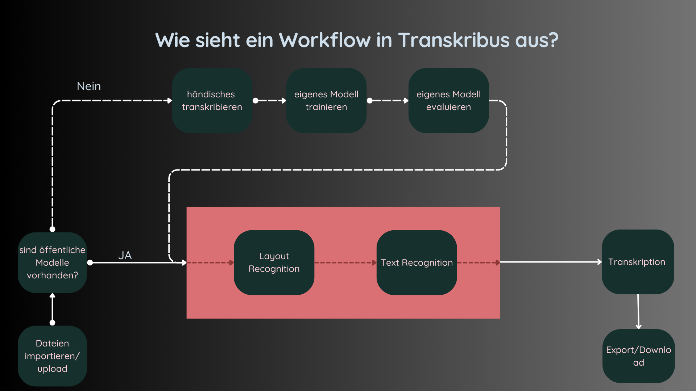

Bezüglich der Datenschutzrichtlinien:[Datenschutzrichtlinien der READ-COOP](https://www.transkribus.org/plans) (Stand Juli 2024))

## 2.5 Kosten und Preisgestaltung

{{0-1}}
********************************************************************************
Grundsätzlich benötigen Sie für alle Tätigkeiten in Transkribus einen Account bei der READ-COOP. Diesen können Sie sich kostenlos auf der [Hauptseite der READ-COOP](https://readcoop.eu) einrichten.
Wenn Sie Ihre Digitalisate händisch oder manuell transkribieren, entstehen Ihnen für die Nutzung von Transkribus erst einmal keine Kosten. Wenn Sie die automatische Layout-und Texterkennung nutzen, müssen Sie dies jedoch mit sogenannten Credits zahlen. Diese Credits sind die Währung in Transkribus, mit der Sie alle Tätigkeiten, für die Sie KI-Modelle nutzen, bezahlen.
Im Januar 2024 wurde das Bezahlmodell umgestellt: Demnach werden allen Personen, die ein "Individual" Konto haben, 100 Credits jeden Monat kostenlos zur Verfügung gestellt, welche nach einer bestimmten Zeit verfallen, wenn sie nicht genutzt werden. Das "Individual" Konto ist das Standardkonto in Transkribus und ist kostenfrei. Langfristig ermöglicht es Ihnen mehr Flexibilität für eigene Projekte und ist für Anfänger mehr als ausreichend.


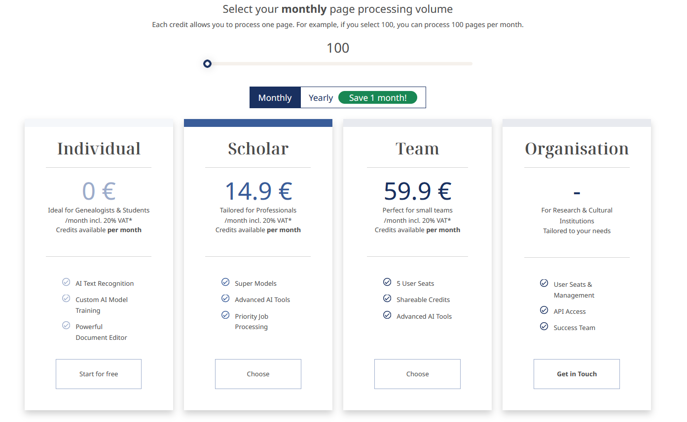


Quelle: [Plans & Pricing Transkribus](https://www.transkribus.org/plans) (Stand Juli 2024)

********************************************************************************

{{1}}
********************************************************************************
Mit dem "Individual" Konto hat man Zugriff auf alle grundlegenden Funktionen von Transkribus. Wenn Sie allerdings schon wissen, dass Sie für ein Projekt spezifische Anforderungen an Transkribus haben, so sollten Sie sich einmal mit dem Leistungsangebot der einzelnen Kontenarten auseinandersetzen. Zum Beispiel erhalten Sie mit dem "Individual" Konto nur Zugriff auf die öffentlichen Modelle der Community, nicht aber auf die wesentlich größeren Transformermodelle.

********************************************************************************


# 3 Transkribus als Web-App (Ein Beispielprojekt)

{{0-1}}
********************************************************************************
Exemplarisch soll hier einmal der Workflow in Transkribus anhand eines Tagebuchfragments aus den Beständen der Universitätsbibliothek zu Kiel nachvollzogen werden. Hierfür ist es notwendig, dass Sie sich einen Account bei der READ-COOP einrichten, um auf Transkribus zugreifen zu können. Die Einrichtung des "Individual" Kontos ist kostenlos und können Sie [hier abschließen.](https://account.readcoop.eu) Am Ende dieser Einheit können Sie Ihr neu erworbenes Wissen in einem Quiz auf die Probe stellen.

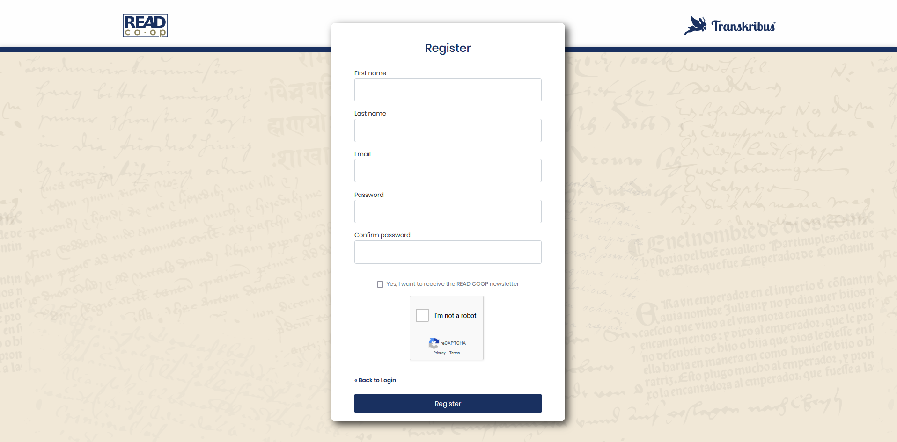

********************************************************************************

{{1}}
********************************************************************************
Bei den Tagebuchfragmenten handelt es sich um eine Abschrift, in der es thematisch um den polnischen Aufstand 1831 geht. 

Die Fragmente können auf der Seite der UB heruntergeladen werden. Dafür öffnen Sie links das Drop down Menu "Zitieren und Nachnutzen" und laden dann die Bilder als PDF runter. Alternativ können Sie auch die Bilder einzeln herunterladen. Dafür klicken Sie auf den Button "Bild" und wählen dann das gewünschte Dateiformat aus. Hier sei darauf hingewiesen, dass das TIFF-Format von Transkribus nicht unterstützt wird. [Hier geht es zur Seite](http://dibiki.ub.uni-kiel.de/viewer/resolver?urn=urn:nbn:de:gbv:8:2-1796765)


<div style="text-align: center;">

</div>

********************************************************************************

## 3.1 Das User Interface von Transkribus

{{0-1}}
********************************************************************************
Wenn Sie sich zum ersten mal einloggen, gelangen Sie auf die Startseite von Transkribus Desk. In Transkribus Desk finden Sie alle Funktionen von Transkribus, die zum Bearbeiten, Verwalten und Transkribieren Ihrer Digitalisate notwendig sind. Der Desk ist aufgeteilt in drei Bereiche:


1. **Die Startseite:**
   - Hier erhalten Sie einen Überblick über die Dokumente, an denen Sie zuletzt gearbeitet haben. Außerdem können Sie Ihre Collections nach Schlagwörtern durchsuchen und Dokumente hochladen und schnell erkennen lassen.
2. **Sammlungen:**
   - Hier können Sie alle Ihre hochgeladenen Digitalisate verwalten und bearbeiten.
3. **Tags:**
   - Hier können Sie Ihre Tags zum Annotieren verwalten.


********************************************************************************

{{1-2}}
********************************************************************************
Rechts neben dem "Desk" befindet sich die Seite für die Modelle. Dort werden alle Modelle, die Sie selbst trainiert haben angezeigt und dort können Sie auch neue Modelle trainieren. In der Galerie können Sie alle öffentlich nutzbaren Modelle einsehen und bereits vorher erste Eindrücke sammeln, welche Modelle Sie für Ihr Projekt vielleicht verwenden möchten.


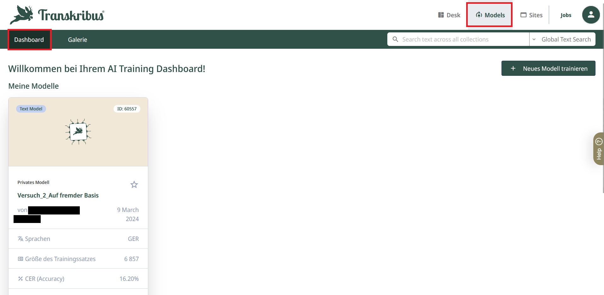

********************************************************************************

{{2-3}}
********************************************************************************
Rechts daneben befindet sich die Seite von Transkribus Sites. Transkribus Sites dient dazu bereits fertig transkribierte Corpora zu publizieren.


********************************************************************************

{{3}}
********************************************************************************
Abschließend sei hier auf die beiden Schaltflächen oben rechts verwiesen:


1. **Jobs:**
   - Hier erhalten Sie einen Überblick über die letzten Aufträge ("Jobs") die auf dem Server der  READ-COOPausgeführt wurden. Dort können Sie überprüfen, ob ihre Digitalisate fertig hochgeladen wurden, ihr Modelltraining abgeschlossen ist oder aber Ihre Layout- und Text Recognition fertig ist.
2. **Profil Icon**
   - Hier könnnen Sie Ihr Profil verwalten, die Sprache einstellen oder Ihren Creditverbrauch überwachen.


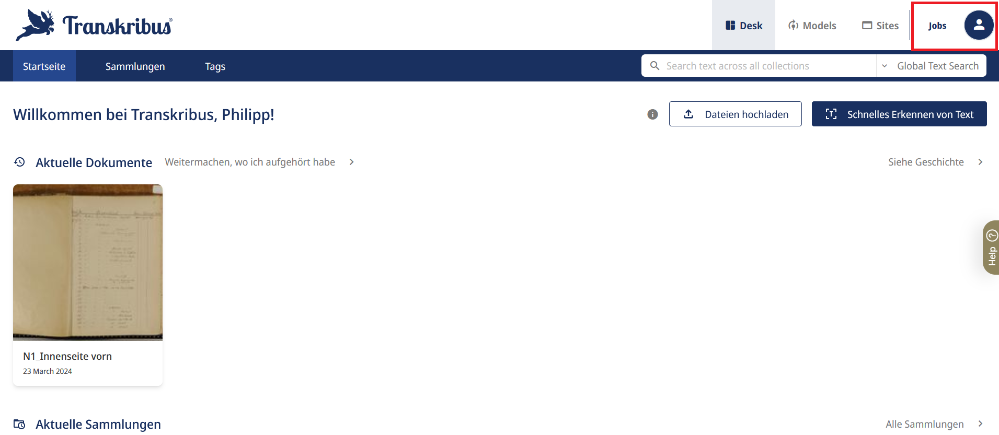

********************************************************************************

## 3.2 Daten importieren

{{0-1}}
********************************************************************************
Um die Tagebuchfragmente, die Sie von der Seite der Universitätsbibliothek Kiel heruntergeladen haben später in Transkribus hochzuladen, müssen Sie zunächst eine Collection anlegen. Eine Collection entspricht einem Ordner, in dem Sie alle Ihre hochgeladenen Digitalisate, seien es einzelne Bilder oder ganze Jahrgänge, in sogenannten Documents zusammenfassen und verwalten können. Daher muss zuerst eine Collection angelegt werden, um die zukünftigen Digitalisate abzulegen.


********************************************************************************

{{1-2}}
********************************************************************************
Nachdem die Collection angelegt wurde, wählen Sie diese aus und klicken Sie auf den auf den Button „Upload Files“. In dem sich nun öffnenden Fenster können Sie auswählen, ob Sie ein „Image“ (jpeg oder PNG-Dateien) oder PDFs hochladen möchten. Gleichwohl können Sie den Namen der Dateien in der Collection neu bestimmen, und Sie danach per Drag&Drop entweder direkt ins Feld einfügen oder über die Browse-Funktion auswählen. In unserem Fall fügen wir die PDF mit den Briefseiten in das Drag & Drop Feld ein.


<div style="display: flex; justify-content: space-between;">
    
    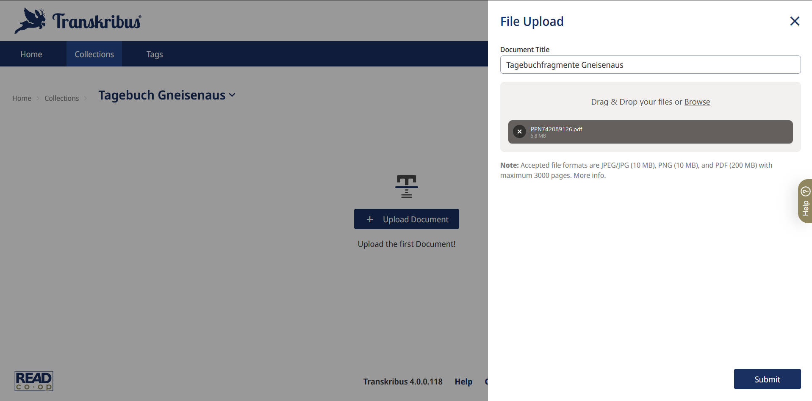
</div>

********************************************************************************

{{2}}
********************************************************************************
Nachdem Sie ihre Dateien hochgeladen haben dauert es einen Moment, bis Ihnen Ihre Digitalisate angezeigt werden, da diese auf dem Server abgelegt werden müssen. Danach finden Sie sie zusammengefasst als Document in der Collection. Sie können unter dem Reiter "Jobs" überprüfen, ob der Upload abgeschlossen ist.


<div style="display: flex; justify-content: space-between;">
    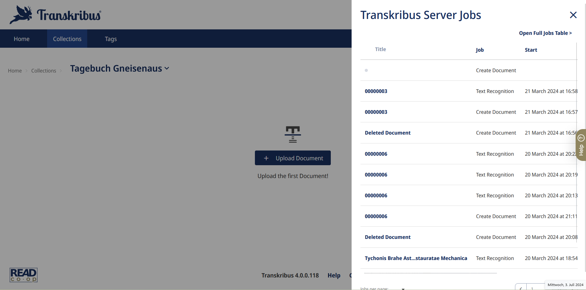
    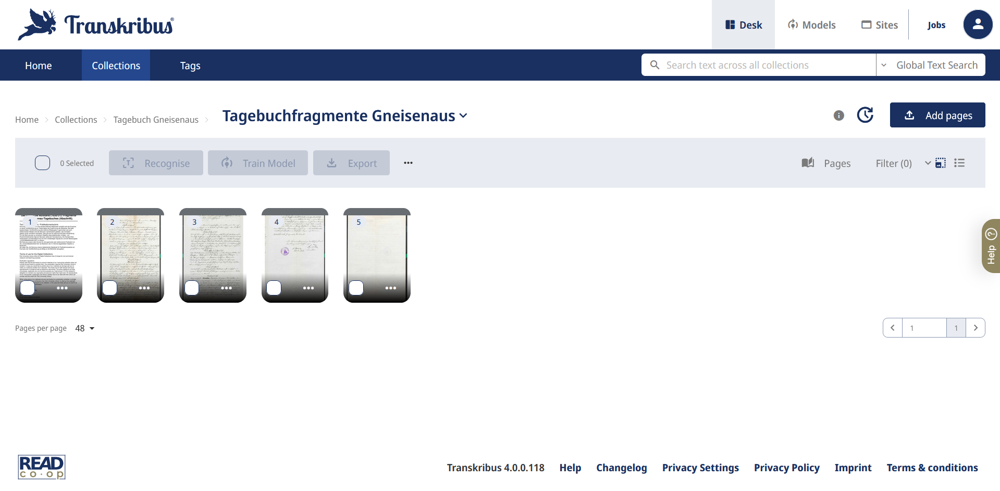
</div>

********************************************************************************

## 3.3 Der Editor: Tools zum Bearbeiten und Transkribieren

{{0-1}}
********************************************************************************
Wenn Sie nun auf einen der Briefe klicken, öffnet sich der Editor. Hier stehen Ihnen verschiedene Funktionen zur Verfügung, um den Brief zu transkribieren oder mit Metadaten anzureichern:

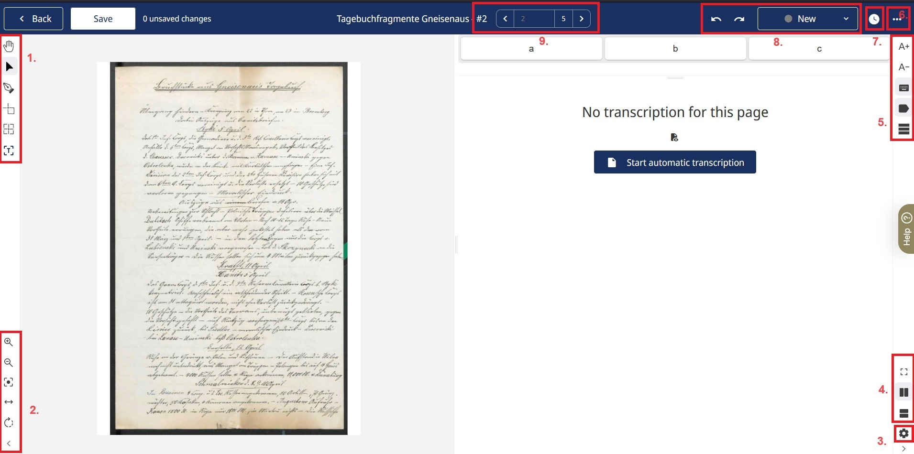

1.
  - Hier befinden sich alle Tools die Sie brauchen, wenn Sie das Layout des Briefes händisch erfassen wollen. Außerdem gibt es auch eine Verknüpfung zur automatisierten Erfassung [T].
2.
  - Diese Funktionen dienen zur Betrachtung des Briefes (Zoom, etc.).
3.
  - Configurations: Hier lassen sich einige Oberflächen des Editors anpassen.
4.
  - Hier können Sie die Position des Digitalisats im Verhältnis zum Digitalisat angezeigt. Standardmäßig wird die Transkription rechts parallel zur Quelle angezeigt.
5.
  - Hier lassen sich die virtuelle Tastatur und die Tags für das Dokument einschalten, sowie die Schriftgröße des Editors einstellen.
6.
  - Hier sind verschiedene Verknüpfungen zum Export, für Hilfe oder zum Teilen vereint. 
7.
  - Versionskontrolle: Hier erhalten Sie einen Überblick über alle gespeicherten Varianten Ihres Digitalisates und können jederzeit auf einen früheren Bearbeitungszustand zurückgreifen.
8.
  - Hier lassen sich Fehler mit den Pfeilen rückgängig machen und mit dem danebenliegenden Dropdown-Menü können Sie dem Dokument einen Status zuordnen.
9.
  - Hier können Sie zwischen den einzelnen Seiten des Briefes hin und her wechseln.


********************************************************************************

{{1}}
********************************************************************************

Die Einstellungsmöglichkeiten:


1.
  - Text: Hier könnne Sie die Schriftart sowie die Ausrichtung des Textes einstellen.
2.
  - Image: Hier können Sie einstellen, ob Sie sich die Baselines und die Textregions anzeigen lassen möchten und die Farben und Größen anpassen.
3.
  - Virtual Keyboard: Wenn Sie Sonderzeichen benötigen, weil der zu transkribierende Text Buchstaben enthält, die nicht auf der Tastatur vorhanden sind, können Sie diese hier einfügen, um später auf sie zurückzugreifen. Sie benötigen lediglich den Unicode des Zeichens.
4.
  - Hier können Sie die Tags aktivieren, die Sie für das Digitalisat brauchen. Gleichwohl können Sie hier unter "Edit tags in collection settings" selbst Tags definieren, um sie zu benutzen.


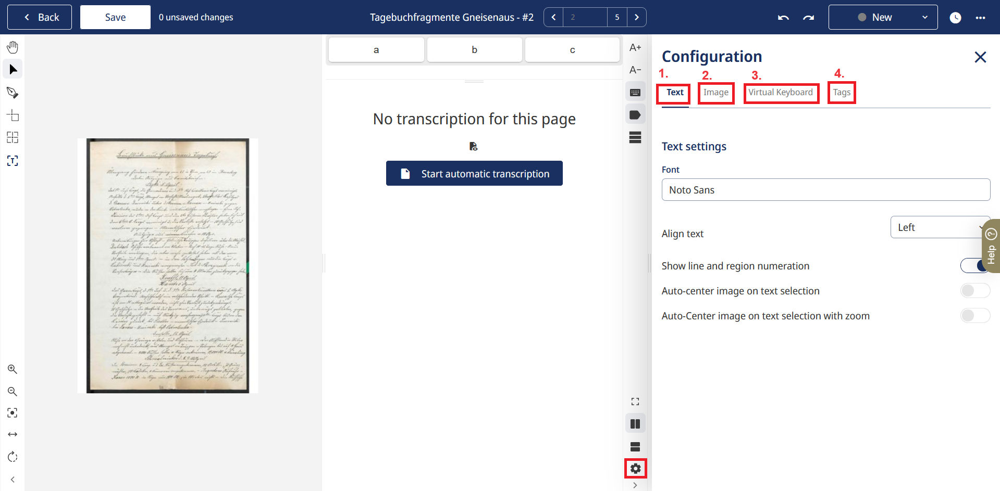

********************************************************************************

### 3.3.1 Der Editor zum manuellen transkribieren

{{0-1}}
********************************************************************************
Wenn Sie nun Ihre Quelle manuell transkribieren möchten, so müssen Sie zuerst im Digitalisat die Fläche definieren, in der sich der zu transkribierende Text befindet. Dafür wählen Sie in der Leiste oben rechts das Tool "Add Region" aus und ziehen eine Fläche über die ganze Seite. Wenn Sie dies gemacht haben, erscheint im rechten Feld ein Banner mit "Region 1". Die daraus resultierende Fläche definiert den Bereich, in dem ein Text vorhanden ist.


1. 
 - Add Line
2. 
 - Add Region
3. 
 - Add Table
4. 
- Automatische Texterkennung
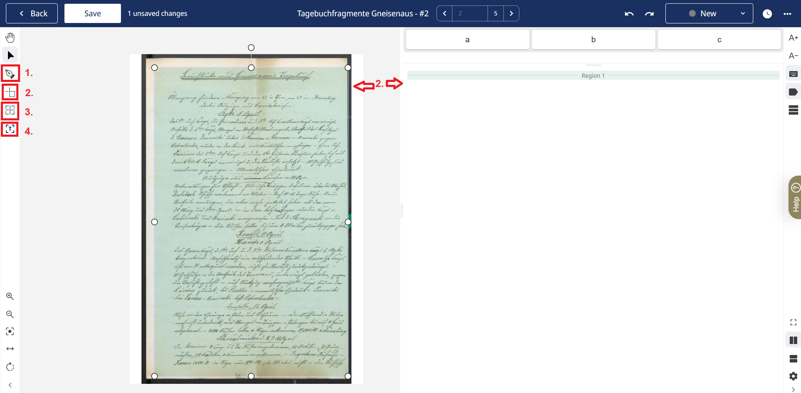

********************************************************************************

{{1-2}}
********************************************************************************
Nun müssen Sie die Bereiche innerhalb der Textregion definieren, in denen die Textzeilen stehen. Dafür wählen Sie aus den Tools "Add Line" aus und ziehen die Linien (Baselines) entlang der Zeilen in Ihrer Quelle. Dadurch definieren Sie die Zeilen in Ihrer Textregion und fügen dann automatisch auf der rechten Seite die Zeile ein. Dadurch können Sie nun auf der rechten Seite die Transkription der entsprechenden Zeile vornehmen. Das Setzen der Textregion und der Baselines wird in der Layoutrecognition automatisch ausgeführt, wenn Sie Texte automatisch transkribieren lassen. Dies ist jedoch fehleranfälliger, da die KI z.B. auch etwaige Verunreinigungen oder Randnotizen als eine vollwertige Zeile anerkennen kann.

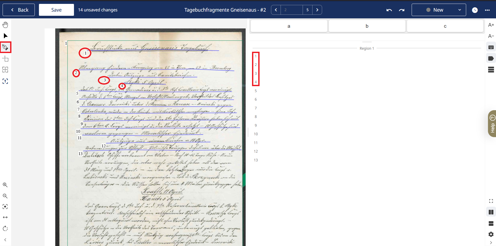

********************************************************************************

### 3.3.2 Automatisches transkribieren mit Modellen

{{0-1}}
********************************************************************************
Wenn Sie nun Ihre Digitalisate automatisch transkribieren möchten, so gibt es zwei Möglichkeiten:
{{0-1}}
1. Öffnen Sie die Collection, in der sich die Documents befinden, die Sie transkribieren lassen möchten. Wählen Sie hier die entsprechenden Seiten mit einem Häkchen aus. Klicken Sie anschließend auf „Recognise“


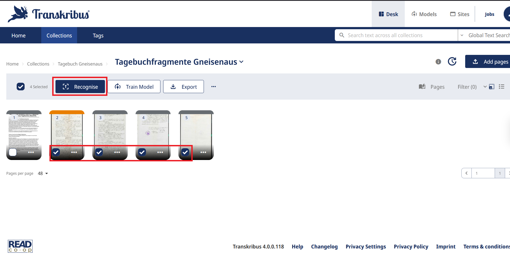

********************************************************************************

{{1-2}}
********************************************************************************
In diesem Menü können Sie nun einstellen, welches Modell Sie nutzen möchten.


1. Hier könnne Sie Modell nun nach Sprache, gedruckt oder ungegdruckt, oder Jahrhundert filtern. Wenn Sie genug Material haben, können Sie auch später ein eigenes Model trainieren und es benutzen.
2. Hier sehen Sie die Parameter des aktuell ausgewählten Modells.
3. Hier können Sie die automatische Transkription starten und erhalten einen Überblick, wie viele Credits für das Transkribieren verbraucht werden. Wenn Sie die Recognition starten, kann es ein paar Sekunden oder aber auch eine Stunde dauern, bis die Transkription fertiggestellt ist. Es hängt davon ab, wie viele Seiten Sie transkribieren lassen wollen und wie stark der Server bereits ausgelastet ist.
4. Hier wird angezeigt, welche Collection geöffnet ist und welcher Modelltyp genutzt wird. Zurzeit können Sie nur auf die "Textrecognition" (erkennen und transkribieren von Texten) zugreifen. Zu einem späteren Zeitpunkt soll Transkribus auch um selbsttrainierbare Modelle zur Layout-, Field- und Tablerecognition erweitert werden. Diese sollen dann dabei helfen, besondere oder herausfordernde Strukturen, wie z.B. Tabellen, zu erfassen.


********************************************************************************

{{2-3}}
********************************************************************************
Nachdem Sie die Textrecognition gestartet haben, können Sie am oberen rechten Rand unter Jobs nachverfolgen, ob die Transkription abgeschlossen ist.


Auf der linken Seite zeigt sich der erkannte Text sowie die sogenannte Textregion und die Baselines (Zeilen, die das Modell erkannt und gelesen hat). Jede Baseline ist mit einer Nummer auf der rechten Seite verknüpft, die die Zeile angibt und den transkribierten Text anzeigt.


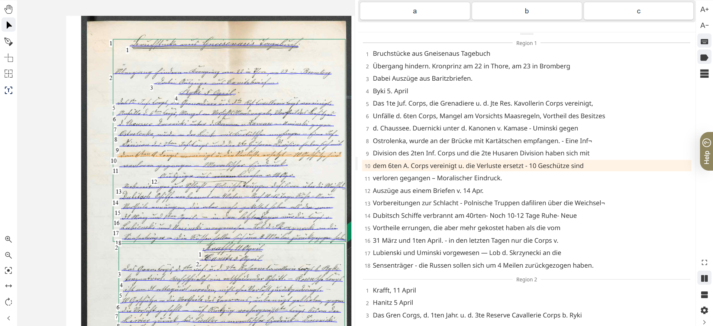

********************************************************************************

{{3-4}}
********************************************************************************
Alternativer Ansatz:
Im Home Bildschirm werden Ihnen Ihre Collections und Ihre zuletzt genutzten Dokumente angezeigt. Sie können nun über den Button „Quick Text Recognition“ Ihre Quellen direkt hochladen und mit einem Modell lesen lassen.


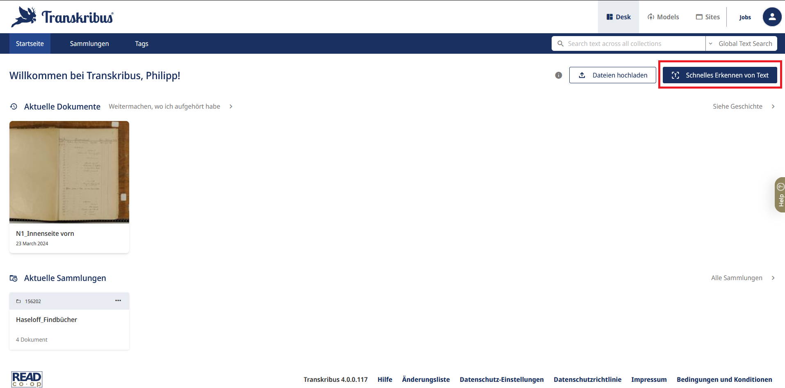

********************************************************************************

{{4-5}}
********************************************************************************
Geben Sie an, in welcher Sprache Ihre Quelle geschrieben ist und ob sie handschriftlich oder gedruckt sind. Transkribus wählt dann anhand dieser Parameter das passende Modell zum automatischen Transkribieren aus. Wählen Sie dann eine Collection aus, in der Ihre Quellen abgelegt werden sollen (die Collection muss vorher erstellt werden) und fügen Sie die gewünschten Dateien ein.


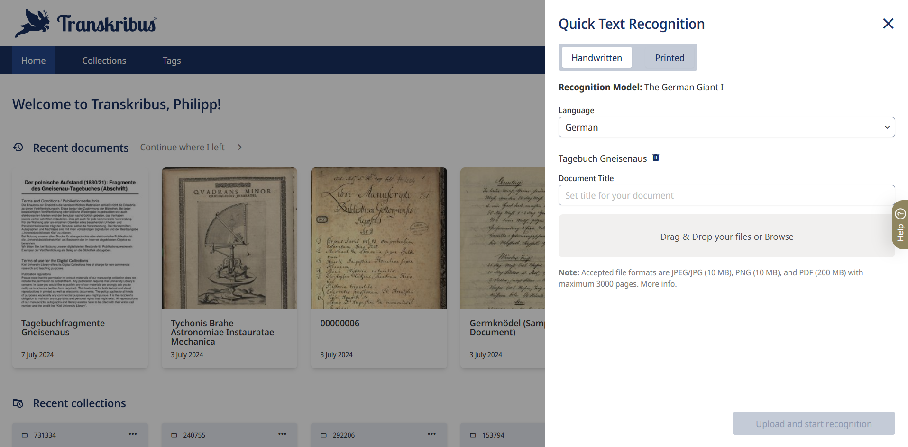

********************************************************************************

## 3.4 Tagging: Annotation und Metadaten

{{0-1}}
********************************************************************************
Wenn Sie Ihre Dokumente nun transkribiert haben, können Sie Ihre Texte mit Meta-Daten anreichern. Hierfür können Sie mit sogenannten "Tags" Wörter oder Sätze markieren, um ihnen eine Eigenschaft zuzuordnen. Damit Sie die Tags nutzen können, müssen Sie diese erst für ihr jeweiliges Dokument aktivieren. Dies machen Sie in der Leiste rechts oben.


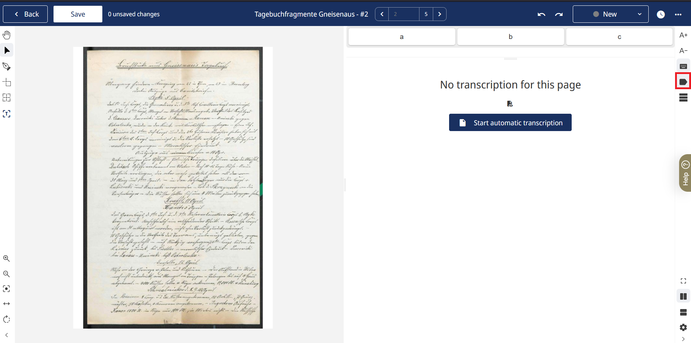

********************************************************************************

{{1-2}}
********************************************************************************
Unter den Einstellungen können sie unter "Tags" die Tags aktivieren, die sie wirklich für ihr Dokument brauchen. Es gibt zwei Arten von Tags, die Sie verwenden können:


1.
 - Structural Tags: Mit diesen Tags können Sie Layout-Elemente kenntlich machen, welche dann in das XML des Dokuments integriert werden.
2.
 - Textual Tags: Diese dienen dazu, den Inhalt eines Textes näher zu beschreiben und leichter durchsuchbar zu machen. 


Für die Tagebuchseite aktivieren wir den Textual-Tag "place", um Orte markieren zu können. Dazu gehen Sie in die Configuration und suchen unter Textual und wählen entsprechenden Tag aus.


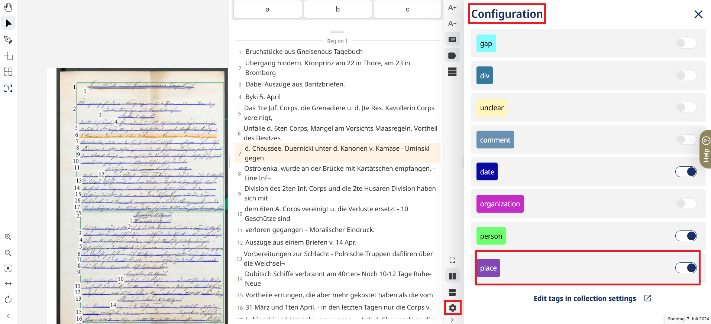

********************************************************************************

{{2-3}}
********************************************************************************
Nun können Sie alle Orte im Text taggen. Markieren Sie dafür den entsprechenden Ort - hier ist es die Stadt Bromberg - und klicken Sie dann auf den Tag "place". Nun ist die Stadt markiert und kann als Tag exportiert werden. Dies geschieht tabellarisch als XLSX-Datei. Hierfür benötigen Sie jedoch mindestens ein "Scholar-Konto"


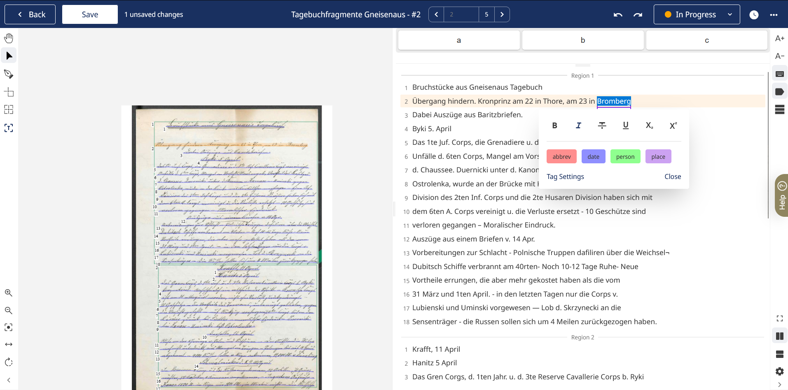

********************************************************************************

## 3.5 Der Export

{{0-1}}
********************************************************************************
Öffnen Sie das Dokument aus dem Sie Ihre transkribierten Seiten exportieren möchten und markieren Sie die zu exportierenden Bilder mit einem Häkchen. Klicken Sie dann auf Export. 


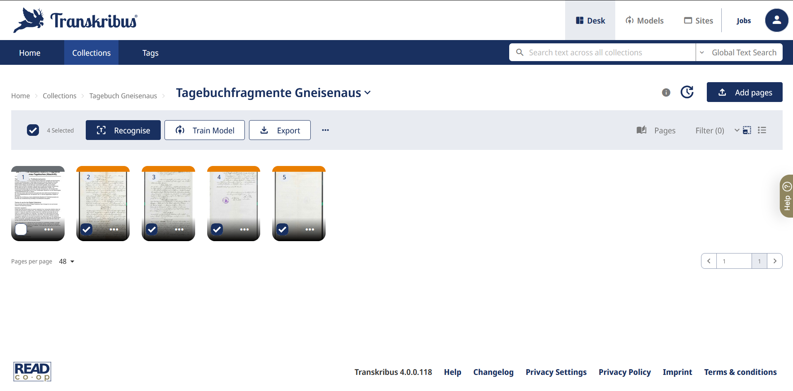

********************************************************************************

{{1-2}}
********************************************************************************
Wählen Sie dann das entsprechende Dateiformat aus. Sie erhalten einen Downloadlink auf Ihre angegebene Emailadresse, worüber Sie Ihre Transkription vom Server herunterladen können.


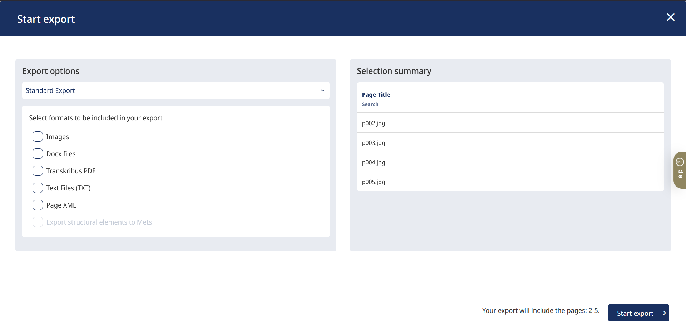

********************************************************************************

## 3.6 Das Transkribus Quiz
Willkommen zum Quiz über Transkribus! Testen Sie ihr Wissen über dieses leistungsstarke Tool zur Transkription und Dokumentanalyse.

### Frage 1

Wie nennt man die Technologien, die für die automatische Transkription in Transkribus verwendet wird?

[[ ]] ABBYY
[[x]] HTR
[[x]] OCR
[[ ]] Tesseract

### Frage 2

Welche Dateiformate können Sie zum Hochladen Ihrer Quellen verwenden?

[[ ]] .docx
[[x]] .pdf
[[ ]] .txt
[[x]] .jpg
[[ ]] .TIFF

### Frage 3

Welche der folgenden Funktionen bietet Transkribus nicht an?

[[ ]] Volltextsuche in transkribierten Dokumenten
[[ ]] Export von Transkriptionen in verschiedenen Formaten
[[x]] Automatische √úbersetzung der Transkriptionen
[[ ]] Layout-Analyse von Dokumentenseiten

### Frage 4

Welches ist der erste Schritt bei der Nutzung von Transkribus?

[[ ]] Transkription von Text
[[x]] Hochladen von Dokumenten
[[ ]] Exportieren von Ergebnissen
[[ ]] Durchführen einer Layout-Analyse

### Frage 5

Kann Transkribus sowohl gedruckten als auch handschriftlichen Text verarbeiten?

[[x]] Ja
[[ ]] Nein

### Frage 6

Wie können Nutzer:innen Ihre eigenen Modelle verbessern?

[[ ]] Indem Sie sie möglichst oft verwenden
[[x]] Indem Sie sicherstellen, dass Ihre Ground Truth korrekt ist
[[x]] Indem Sie sich bei der manuellen Transkriptionen an einheitliche Richtlinien halten
[[ ]] Durch das Teilen von Dokumenten auf Social Media

### Frage 7

Die Transformermodelle...?

[[x]] sind die größten Modelle die zum Transkribieren genutzt werden können
[[ ]] sind die kleinsten Modelle
[[x]] sind kostenpflichtig
[[ ]] lösen alle Probleme

### Frage 8

Wie viele Wörter müssen transkribiert werden, um ein eigenes HTR-Modell zu trainieren?

[[ ]] Mindestens 500 Wörter
[[ ]] Mindestens 5678 Wörter
[[x]] Mindestens 4000 Wörter
[[ ]] Maximal 2500 Wörter

### Frage 9

Ist Transkribus kostenlos nutzbar?

[[ ]] Ja, uneingeschränkt
[[x]] Ja, aber mit eingeschränkten Funktionen
[[ ]] Nein, nur kostenpflichtig

### Frage 10

In Transkribus lassen sich Texte nur manuell transkribieren?

[[ ]] Ja
[[x]] Nein


# 4 Modell-Training: Der Weg zum eigenen Modell

Nachdem Sie nun die grundlegenden Funktionen von Transkribus anhand von Gneisenaus Briefen kennengelernt haben, erhalten Sie hier nun einen tieferen Einblick ins Modelltraining. Hierzu wird jedoch nicht auf die Brieffragmente zurückgegriffen.

-----

Neben den öffentlichen Modellen, die Sie nutzen können, um aus Ihren Digitalisaten den Text zu extrahieren, besteht auch die Möglichkeit eigene Modelle zu trainieren. Eigene Modelle zu trainieren kann dann besonders Sinn ergeben, wenn:

1. die öffentlichen Modelle nicht sehr gut auf Ihren Materialien funktionieren. Handschriften sind sehr individuell, weshalb es teilweise sehr schwer ist, passende Modelle zu finden, die genau zum Digitalisat passen.
2. Sie viele Sonderzeichen in Ihren Handschriften haben, die nicht in öffentlichen Modellen enthalten sind.
3. Sie viele Seiten zum transkribieren haben.

-----

> Für ein erstes kleines Modell brauchen Sie zwischen 4.000-5.000 Wörtern. Öffnen Sie die Seite "Models" und klicken Sie auf "Train New Model". Dort können Sie auswählen, ob Sie ein Text Recognition Modell oder ein Baselinemodel trainieren möchten. 
> Baselinemodels dienen dazu, die Baselines bei komplexen Digitalisaten richtig zu setzen. Normalerweise werden diese bei der Layoutrecognition automatisch gesetzt. Wenn die Quelle jedoch von der Struktur her sehr anspruchsvoll ist und die die Layoutrecognition die Baselines nicht richtig setzt, kann man ein eigenes Modell trainieren. Das Training von Baselinemodels ist analog zu dem der Textrecognition.

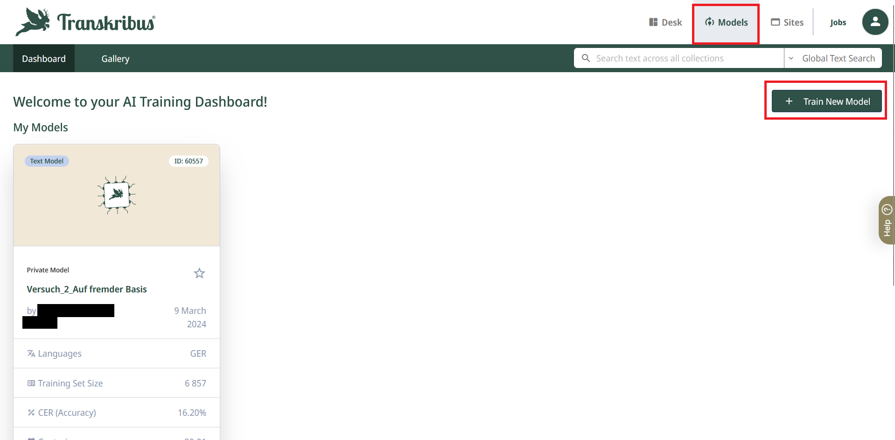

## 4.1 Auswahl der Trainingsmaterialien

{{0-1}}
********************************************************************************
Wenn Sie nun ihr eigenes Modell trainieren möchten, so müssen Sie erst die Collection und dann das Dokument auswählen, mit dem Sie ein Modell trainieren möchten. (Da der Brief zu klein ist, um ausreichend Wörter für ein Modelltraining bereitzustellen, wird hier exemplarisch ein anderer Datensatz genutzt).


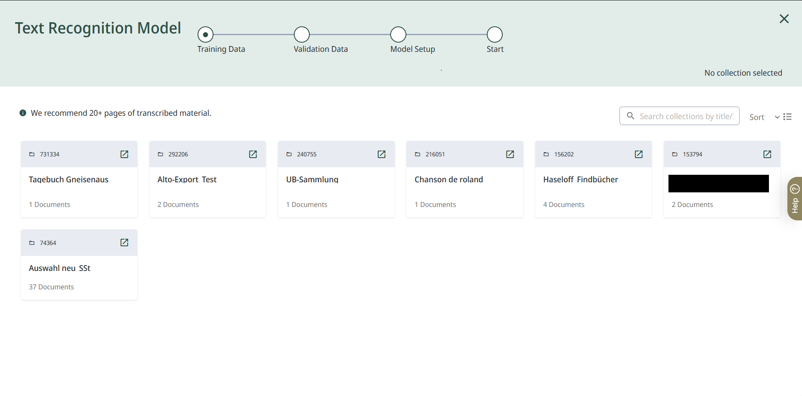

********************************************************************************

{{1-2}}
********************************************************************************
Nachdem Sie ihr Dokument aufteilen in eine Ground Truth und in ein Validationset:


 1.
Ground Truth: Die Seiten, die Sie zum Trainieren des Modells verwenden bilden die Ground Truth.
 2.
Validationset: Das Validationset dient dazu, zu evaluieren, wie gut das trainierte Modell performt.


Sie können auswählen, ob Transkribus selbst ein Validationset anhand von 10%, 5% oder 3% erstellt oder aber manuell die Seiten aussuchen, die ins Validationset sollen. Wichtig ist hierbei, dass das Validationset die Ground Truth widerspiegelt. Wenn Sie z.B. einen Datensatz haben, der zu 50% aus Tabellen und zu 50% aus Fließtext besteht, ergibt es wenig Sinn, das Validationset ausschließlich aus Tabellen bestehen zu lassen, da das Modell sowohl auf Fließtext als auch auf Tabellen trainiert wurde. Außerdem sollten Sie vermeiden, Seiten, die bereits in der Ground Truth vorhanden sind, auch ins Validationset einzufügen, da Sie dadurch der KI theoretisch die "Lösung vor der Prüfung" verraten könnten.


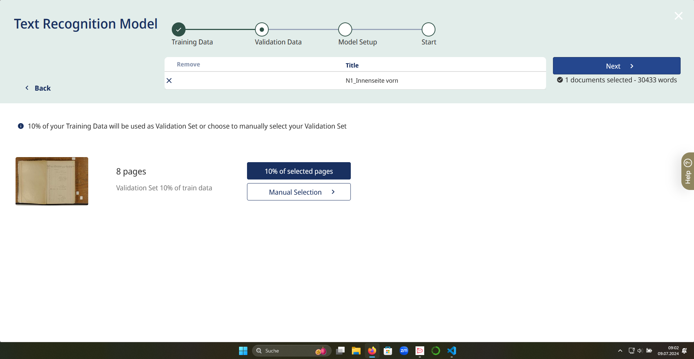

********************************************************************************

{{2-3}}
********************************************************************************
Wenn Sie nun Ihren Datensatz aufgeteilt haben, können Sie noch entsprechende Metadaten (Name, Zeitraum der Handschrift, Beschreibungen, etc.) hinzufügen.
Außerdem können Sie sich hier entscheiden, ob Sie ihr Modell auf einem bereits bestehenden trainieren möchten. Dies kann für Sie dann interessant sein, wenn ein öffentliches Modell grundsätzlich gut auf Ihren Digitalisaten performt, jedoch mit einzelnen Zeichen Probleme hat. Sie können das entsprechende öffentliche Modell als Basis für ihr Modell nutzen und es mit Ihrem Datensatz anpassen.


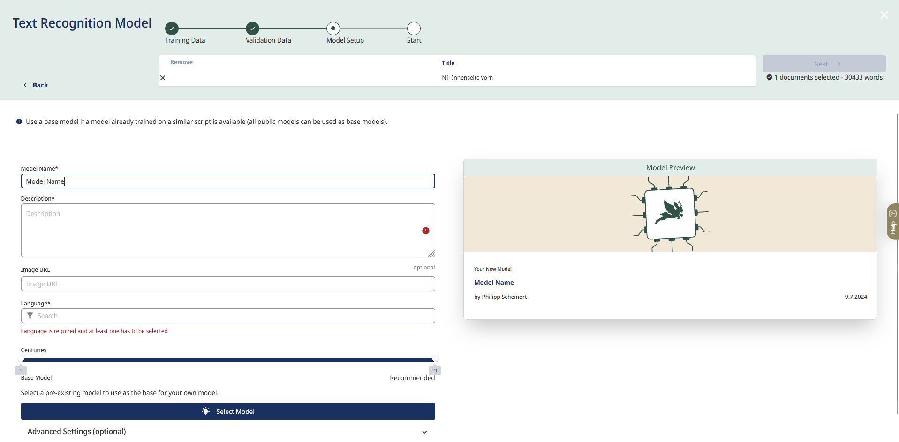

********************************************************************************

## 4.2 Evaluation des eigenen Modells: CER (Chararacter Error Rate)

Nachdem das eigene Modell trainiert wurde, ist es notwendig zu evaluieren, wie gut es funktioniert. Dafür gibt es zwei Messzahlen: die Character Error Rate (CER) und die Word Error Rate (WER). Beide messen die Anzahl der Fehler, die ein Modell auf einem bestimmten Datensatz (in Transkribus ist es das Validationset) macht. Hierfür werden die Transkriptionen, die das Modell vom Validationset anfertigt, mit der Originaltranskription verglichen und berechnet, wie stark der automatisch generierte Text vom Original abweicht.

$$
CER = \frac{Alle  fehlerhaften  und  nicht transkribierten Zeichen}{\text{Alle transkribierten Zeichen}} *100
$$

 Während sich die CER auf alle Zeichen (auch Punkte, Komma und Leerzeichen) bezieht, betrachtet die WER nur die Wörter:

$$
WER = \frac{Alle  fehlerhaften  und  nicht transkribierten Zeichen}{\text{Alle transkribierten Wörter}} *100
$$

Dadurch, dass die WER alle Fehler in einem Wort genauso wie die CER zählt, ist sie in der Regel wesentlich höher als die CER.
Wenn man jetzt bemessen möchte, wie gut das Modell funktioniert gibt es folgende Anhaltspunkte:

1. Die OCR ist dann gut, wenn sie eine CER zwischen 0% -2 % hat. Das liegt daran, dass OCR für Drucke, also für leichter zu erkennende Texte verwendet wird.

2. Ein HTR-Modell gilt dann als gut, wenn es über 95% richtig transkribiert hat (also die CER < 5%)

Transkribus verwendet nur die CER als Messzahl für die Modelle. Diese können Sie dann in den Modellparametern nachgucken.

Weiterführend dazu: [CER und WER Uni Greifswald](https://rechtsprechung-im-ostseeraum.archiv.uni-greifswald.de/word-error-rate-character-error-rate-how-to-evaluate-a-model/)

## 4.3 Tipps, Tricks und Transformermodelle

Wenn Sie selbst ein Modell trainieren möchten, so gibt es hier ein paar Hinweise:

1. Stellen Sie Regeln für Ihre Transkription und den Workflow auf. Transkribus kann Abkürzungen und Sonderzeichen erkennen und umsetzen. Wenn Sie in Ihrer Ground Truth nur willkürlich die Sonderzeichen oder Abkürzungen genutzt haben, so kann es beim automatisierten Transkribieren ebenfalls willkürlich wirken. Konsistenz ist wichtig.

2. Wenn Sie Modelle trainieren, so trainieren Sie ein Modell dass das Schriftbild erkennt und **nicht** die Sprache. Grammatik und Rechtschreibung werden von Modellen nicht beherrscht. Wenn Sie aus versehen z.B Großbuchstaben innerhalb von Wörtern vergessen oder stehen lassen, anstatt sie zu korrigieren, kann es sein, dass das Modell eben solche auch in den Text übernehmen wird.

3. Anstatt Fehler aus bestehenden Modellen "rauszutrainieren" ist es manchmal besser, die Ground Truth zu korrigieren und dann einmal ein vollständig neues Modell zu trainieren.

4. Sie können alle Sonderzeichen und Symbole in Transkribus verwenden, die über einen Unicode verfügen.

5. Nutzen Sie die Einstellungen und passen Sie den Editor an ihr gewünschtes Format an.

6. Transformermodelle wie der "Text-Titan I" sind aktuell die größten Modelle in Transkribus. Sollten Sie ein "Scholar-Konto" haben, sollten Sie die ausprobieren.

# 5 Projekte, Hilfen und weiterführende Ansätze von Transkribus

{{0-1}}
********************************************************************************
**Hilfe**


Sollten Sie Probleme oder Fragen bezüglich der Funktionen von Transkribus haben, so können Sie im Online Handbuch der READ-COOP eine tieferen Einblick erhalten:
[Handbuch Transkribus](https://help.transkribus.org/)


Sollten Sie softwaretechnische Probleme, wie z.B fehlgeschlagene Exporte, haben, so können Sie sich auch direkt an den Helpdesk der READ-COOP wenden: [READ-COOP Helpdesk ](https://help.transkribus.org/kb-tickets/new)


**Datenbanken**

1. Falls Sie Modelle mit vielen verschiedenen Corpora trainieren möchten, können Sie sich die Groundtruth bei HTR-United [runterladen](https://htr-united.github.io/).
2. Außerdem gibt es weitere Datensätze auf dem Repositorium von Zenodo auch eine Datensätze, die für HTR interessant sind. [Zenodo](https://zenodo.org/)
3. Weiterhin bieten auch Universitäten und Archive Digitalisate zum Bearbeiten und Erschließen an. Die Universitätsbibliothek Kiel verfügt über ein eigenes Repositorium in dem viele Drucke und Handschriften zur Verfügung stehen. [UB Repositorium](https://dibiki.ub.uni-kiel.de/viewer/index/)

********************************************************************************

{{1-2}}
********************************************************************************
Die READ-COOP betreibt auch einen eigenen Youtube-Kanal, auf dem Sie sich Tutorials, Webinars und die Vorträge der letzten Transkribus User Conference anschauen können.


!?[Transkribus](https://www.youtube.com/watch?v=lCdL_kKBMn8&list=PL7UbQtd4qlhIMP1KfdjGW3C-KXTxw4KYb)

********************************************************************************

{{2-3}}
********************************************************************************
Falls Sie sich tiefergehend mit ATR in den Geisteswissenschaften und Alternativen zu Transkribus auseinandersetzen wollen, sei Ihnen die Playlist des Deutschen Historischen Instituts Paris bezüglich Workflows bei ATR empfohlen.


!?[Transkribus](https://www.youtube.com/watch?v=Arxi4iHFQlM&list=PLDPrG35gxvrSxC86tTZJoEFLn3q0C7ds5)

********************************************************************************

{{3-4}}
********************************************************************************
Transkribus wird in den Geisteswissenschaften auf vielfältige Art und Weise verwendet. Eine Reihe von Projekte stellen die READ-COOP auf Ihrer Website vor:
[Erfolgsgeschichten](https://readcoop.eu/de/erfolgsgeschichten/)

********************************************************************************

{{4-5}}
********************************************************************************
**Scholarship**


Studierende und Forschende, die ein Projekt, sei es privat oder universitär, mit Transkribus umsetzen möchten, können sich um ein Scholarship bewerben. Mit diesem Scholarship erhalten Sie Credits zur Unterstützung. Außerdem können auch Lehrende, die Transkribus für Schulprojekte nutzen möchten sich bewerben. [Zu den Scholarships](https://www.transkribus.org/scholarship)

********************************************************************************

# 6 Alternativen zu Transkribus

{{0-1}}
********************************************************************************
Auch wenn dieser Leitfaden hauptsächlich dazu dient, eine Einführung in Transkribus und die automatisierte Texterkennung zu liefern, sollen hier noch kurz Alternativen zu Transkribus vorgestellt werden. Diese sollten besonders für diejenigen interessant sein, die sich tiefergehend mit OCR und den Digital Humanities auseinandersetzen möchten.

********************************************************************************

{{1-2}}
********************************************************************************
[eScriptorium](https://www.sofer.info/) ist eine Open-Source alternative, die auf der OCR-Software Kraken basiert. Dies hat den Vorteil, dass es auch möglich ist, seine eigenen, trainierten Modelle zu exportieren. Jedoch muss dafür eine eigenen Instanz auf einem Server oder lokal auf dem PC installiert werden oder aber man erhält über eine Institution einen Zugang.


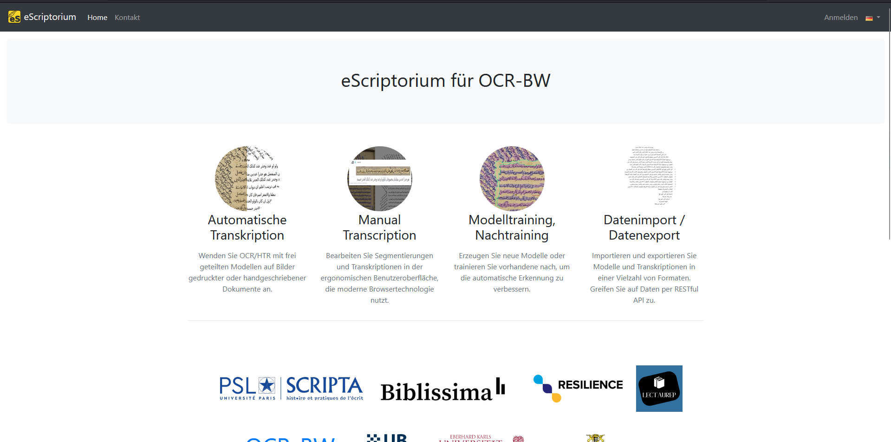

********************************************************************************

{{2-3}}
********************************************************************************
Ähnlich wie eScriptorium ist auch [OCR4all](https://www.ocr4all.org) Open-source. OCR4all braucht ebenfalls eine eigene Instanz und muss über Docker installiert werden. Der Fokus liegt hauptsächlich auf Fraktur- und Antiquaschriften aus dem 19. Jahrhundert.


<iframe
 id="OCR4all"
 title="Website"
 width="90%"
 height="1000"
 src="https://www.ocr4all.org">
 </iframe>

********************************************************************************

{{3-4}}
********************************************************************************
[OCRD](https://ocr-d.de) ist ähnlich wie OCR4all Open-source, verfügt aber im Gegensatz dazu kein richtiges Userinterface. Pythonkenntnisse sind daher notwendig. Der Fokus von OCRD liegt hauptsächlich auf der Massenverarbeitung von Digitalisaten, also auf Drucke des 16./17. oder 18. Jahrhunderts.


<iframe
 id="OCRD"
 title="Website"
 width="90%"
 height="1000"
 src="https://ocr-d.de">
 </iframe>

********************************************************************************

{{4-5}}
********************************************************************************
[Arkindex](https://teklia.com/our-solutions/) ist ein Produkt von Teklia und bietet genau wie Transkribus eine Plattform zum Bearbeiten und Transkribieren von Dokumenten. In Arkindex können nicht nur die Transkriptionen sondern auch die dazugehörigen Zeilen im Bild annotiert werden. Teklia ist auch als Partner bei eScriptorium involviert.


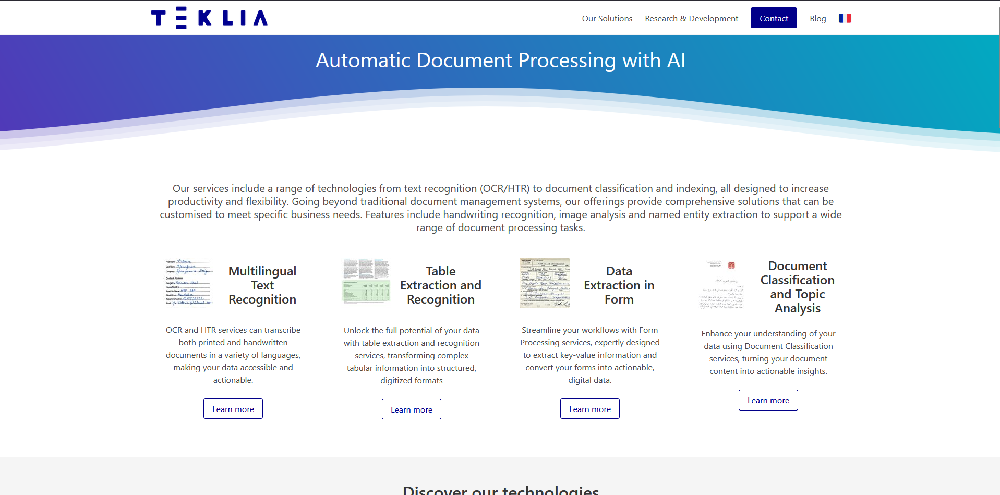

********************************************************************************

{{5-6}}
********************************************************************************
[Pero OCR](https://pero-ocr.fit.vutbr.cz/) ist ein Angebot der Technischen Universität Brünn und ist für den privaten Nutzen kostenlos. Der Fokus von Pero liegt hauptsächlich auf der Erkennung von gedruckten, europäischen Texten. Handschriften beherrscht Pero hauptsächlich nur auf Tschechisch.


<iframe
 id="Pero"
 title="Website"
 width="90%"
 height="1000"
 src="https://pero-ocr.fit.vutbr.cz/">
 </iframe>

********************************************************************************

{{6-7}}
********************************************************************************
[ChatGPT](https://openai.com/chatgpt/) kann auch für OCR und HTR genutzt werden. Jedoch sind die Ergebnisse bis jetzt noch nicht sehr überzeugend hinsichtlich der Handschriftenerkennung. Außerdem sollte auch hinsichtlich des Datenschutzes überlegt werden, ob man ChatGPT nutzt.

********************************************************************************

{{7-8}}
********************************************************************************
| Unterpunkte           | Transkribus | e-Scriptorium | OCR4all | OCRD | Pero | Arkindex | ChatGPT |
|-----------------------|-------------|---------------|---------|------|------|----------|---------|
| **Kosten**            | 3 Unterschiedliche Konten: Individual (Basiszugang zu Transkribus mit 100 kostenlosen Credits im Monat), Scholar (mehr AI-Tools/ 14,90 Euro im Monat), Organisation (Für Institutionen) | Kostenlos und Open-source | Kostenlos und Open-source | Kostenlos und Open-source | Kostenlos und Open-source,allerdings brauch man einen Account bei Pero | Kostenlos und Open-source, allerdings brauch man einen Account bei Teklia | Abonnement- oder Pay-per-use-Modell |
| **Anwendungsbereich** | Automatische Transkription und Layouterkennung, Markieren/Taggen/Annotieren, Tabellenerkennung, Bereitstellung von öffentlichen Modellen | Automatische Transkription und Layouterkennung, Markieren/Taggen/Annotieren | Automatische Transkription und Layouterkennung, Markieren/Taggen/Annotieren mit LAREX | Automatische Transkription und Layouterkennung jedoch deutlich kleinteiliger, Markieren/Taggen/Annotieren, Tabellenerkennung | Automatische Transkription und Layouterkennung, Markieren/Taggen/Annotieren | Automatische Transkription und Layouterkennung, Markieren/Taggen/Annotieren | Generelle Texterstellung, Beantwortung von Fragen, Konversations-KI |
| **Schriftarten & Layout** | Anfangs Fokus auf gedruckten Quellen, Handschriften | Anfangs Fokus auf nicht-lateinischen Handschriften, Gedruckte Quellen | Fokus auf Fraktur- und Antiquaschriften aus dem 19. Jahrhundert | Fokus auf deutschsprachige Drucke des 16./17./18. Jahrhundert, Massenverarbeitung | Verschiedene Handschriften und Druckemit Fokus auf Tschechischen Quellen | Verschiedene Handschriften und Drucke | Keine spezifischen Schriftarten oder Layouts erforderlich |
| **Technische Voraussetzungen** | Einen Webbrowser, Stabile Internetverbindung, Keine Hardwareanforderungen, Keine Code Literacy notwendig, Daten werden in Europa gespeichert, DSGVO konform | Einen Webbrowser, Kann auf einem eigenen Server Rechner oder Cloud installiert werden, Kein Upload auf Fremdservern, Man braucht eine eigene Instanz | Eigener PC oder Server, Muss über Docker installiert werden (Verfügbar für Linux, macOS und Windows), Wird dann über den Browser aufgerufen | PC mit mindestens 8 GB RAM und 20 GB Festplattenspeicher, Installation über GitHub oder Docker, Kenntnisse in Python notwendig, Keine grafische Oberfläche sondern Kommandozeilenbasiert | Webbrowser, keine speziellen Anforderungen | Webbrowser, SQLlite-Kenntnisse| Webbrowser, Internetverbindung |
| **Kollaboration**      | Es können Nutzer zu Collections hinzugefügt werden, Gemeinsames Arbeiten an Dokumenten | Dokumente können zum gemeinsamen Transkribieren und Annotieren geteilt werden, Modelle sind mit Dokumenten verknüpft und nicht mit Usern | Wurde eigentlich für einzelne Nutzer entwickelt, Kann gemeinsam genutzt werden, wenn alles auf einem eigenen Server installiert wurde | Gemeinsame Nutzung möglich, wenn auf eigenem Server installiert | ? | Gemeinsame Nutzung durch mehrere Nutzer, cloud-basiert | Kann in kollaborative Workflows integriert werden |
| **Importformate**     | JPEG/ PNG/ PDF | JPEG/ PNG/ PDF/ IIIF-Manifests, Annotationen können importiert werden: Als ALTO XML/ PAGE XML, Modelle auf Krakenbasis (.mlmodel) | JPEG/ PNG/ PDF | JPEG/ PNG/ PDF | JPEG/ PNG/ PDF | JPEG/ PNG/ PDF/ ZiP-Files/ Manifests von einem IIIF Server | Text, diverse Dokumentformate |
| **Exportformate**     | Docx/ Images/ PDF/ TXT/ Page XML, Alto XML/ TEI Export/ Excel & CSV (nur für Scholarkonten) | Transkription: XML ALTO/ PAGE XML/ TEXT, Annotation: XML ALTO/ PAGE XML/ TEXT, Model: .mlmodel (Kraken) | Alle Daten, die während des Arbeitsprozesses entstehen, werden als PAGE XML gespeichert, Die Transkriptionen können als TXT und PAGE XML exportiert werden | ? | Als eine SQLlite-Datei | - |

********************************************************************************

# 7  Linkverzeichnis

## 7.1 ATR, HTR und OCR Tools

1. [Arkindex](https://teklia.com/our-solutions/arkindex/)
2. [e-Scriptorium](https://ocr-bw.bib.uni-mannheim.de/escriptorium/)
3. [Nopaque](https://nopaque.uni-bielefeld.de/)
4. [OCR4all](https://www.ocr4all.org/)
5. [OCRD](https://ocr-d.de/)
6. [Pero](https://pero-ocr.fit.vutbr.cz/index)
7. [Transkribus](https://www.transkribus.org/)

## 7.2 Datenbanken

1. [HTRunited](https://htr-united.github.io/)
2. [Repositorium der UB Kiel](https://dibiki.ub.uni-kiel.de/viewer/index/)
3. [Repositorium der UB Kiel (Gneisenaus Brieffragmente)](http://dibiki.ub.uni-kiel.de/viewer/resolver?urn=urn:nbn:de:gbv:8:2-1796765)
4. [Zenodo](https://zenodo.org/)

## 7.3 Sonstige

1. [CER und WER Uni Greifswald](https://rechtsprechung-im-ostseeraum.archiv.uni-greifswald.de/word-error-rate-character-error-rate-how-to-evaluate-a-model/)
2. [Transkribus Helpdesk](https://help.transkribus.org/kb-tickets/new)
3. [Transkribus Erfolgsgeschichten](https://readcoop.eu/de/erfolgsgeschichten/)
4. [Transkribus Price & Plans](https://www.transkribus.org/plans)
5. [Transkribus Registrierung](https://account.readcoop.eu/auth/realms/readcoop/protocol/openid-connect/auth?client_id=readcoop-wp&scope=openid%20profile%20roles&redirect_uri=https%3A%2F%2Freadcoop.eu%2Fsso&response_type=code&state=eyI2MTcwNzA2ZTYxNmQ2NSI6eyJWIjoiNTI2NTYxNjQ2MzZmNmY3MDIwNTM1MzRmIiwiSCI6IjczNTM2M2FmNTAyODIwNWFhODA3MTAwZDg0NWE0Y2E0In0sIjcyNjU2NDY5NzI2NTYzNzQ1Zjc1NzI2OSI6eyJWIjoiNjg3NDc0NzA3MzNhMmYyZjcyNjU2MTY0NjM2ZjZmNzAyZTY1NzUyZiIsIkgiOiIxNjZlODQwZmFmMjM2YzFkZmFmNmZiN2JlN2NkNzcyNiJ9LCI3NTY5NjQiOnsiViI6IjQ0NDYzODU2NGI0YTRmMzU0NjQ0NDg1YTQxNTI0MjUyMzU1YTQ0NTMzMjU2MzU0YTM2MzY1NTMyNGU0NDUyIiwiSCI6IjhhNTc5ZDdjODRjOTg0ZDVhODBmNGM2YjhmMGQ0NjljIn19)
6. [READ-COOP](https://readcoop.eu/)
7. [READ-COOP/ Transkribus Youtube-Kanal](https://www.youtube.com/@transkribus)

# 8 Glossar

{{0-1}}
********************************************************************************
In diesem Glossar sollen einmal die wichtigsten Begriffe gesammelt werden. Jeder Begriff ist mit seinem entsprechendem Eintrag im Weißbuch verlinkt, in dem Sie eine genaue Bezeichnung sowie entsprechende Fachliteratur auffinden werden.


1. [Annotationsstandards](https://www.digitale-edition.at/o:konde.29)
2. [Bildformate](https://www.digitale-edition.at/o:konde.122)
3. [Digitale Editionen](https://www.digitale-edition.at/o:konde.59)
4. [Handwritten Text Recognition](https://www.digitale-edition.at/o:konde.224)
5. [Metadaten](https://www.digitale-edition.at/o:konde.225)
6. [Natural Langauage Processing](https://www.digitale-edition.at/o:konde.145)
7. [PAGE-XML](https://www.digitale-edition.at/o:konde.154)
8. [TEI (Text Encoding Initative)](https://www.digitale-edition.at/o:konde.178)
9. [Transkription](https://www.digitale-edition.at/o:konde.197)
10. [XML](https://www.digitale-edition.at/o:konde.215)

********************************************************************************

{{1-2}}
********************************************************************************
Die wichtigsten Begriffe für Transkribus sind mit dem entsprechenden Quellen verlinkt, falls Sie sich tiefergehend damit auseinandersetzen wollen.


1. [Baselines](https://rechtsprechung-im-ostseeraum.archiv.uni-greifswald.de/de/baselines/)
2. [Layoutrecognition](https://help.transkribus.org/automatic-layout-recognition)
3. [Tagging](https://help.transkribus.org/de/tagging-1)
4. [Textregion](https://help.transkribus.org/de/erweiterte-layout-konfigurationseinstellungen)
5. [Transformermodelle (Super Models)](https://help.transkribus.org/super-models)

********************************************************************************